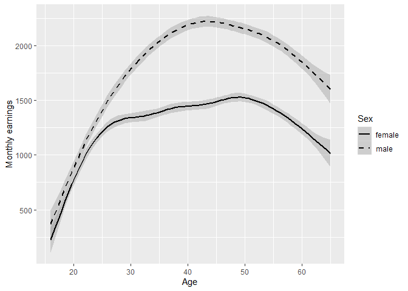
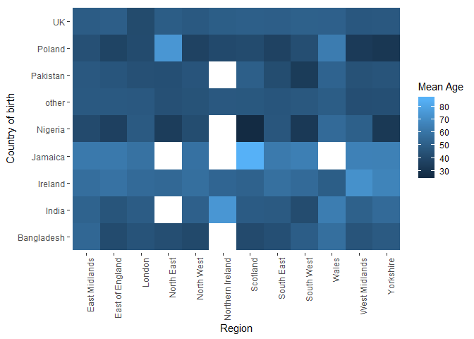
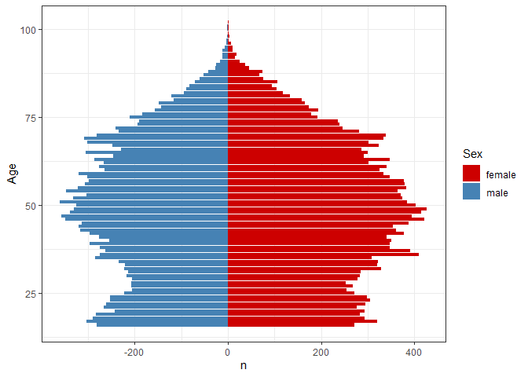

Statistical assignment 4
================
James Hughes, 660056969
27/02/2020

In this assignment you will need to reproduce 5 ggplot graphs. I supply
graphs as images; you need to write the ggplot2 code to reproduce them
and knit and submit a Markdown document with the reproduced graphs (as
well as your .Rmd file).

First we will need to open and recode the data. I supply the code for
this; you only need to change the file paths.

``` r
library(tidyverse)
Data8 <- read_tsv("C:/Users/James/Documents/Data III/assignment-4-jameshughes96/UKDA-6614-tab/tab/ukhls_w8/h_indresp.tab")
Data8 <- Data8 %>%
        select(pidp, h_age_dv, h_payn_dv, h_gor_dv)
Stable <- read_tsv("C:/Users/James/Documents/Data III/assignment-4-jameshughes96/UKDA-6614-tab/tab/ukhls_wx/xwavedat.tab")
Stable <- Stable %>%
        select(pidp, sex_dv, ukborn, plbornc)
Data <- Data8 %>% left_join(Stable, "pidp")
rm(Data8, Stable)
Data <- Data %>%
        mutate(sex_dv = ifelse(sex_dv == 1, "male",
                           ifelse(sex_dv == 2, "female", NA))) %>%
        mutate(h_payn_dv = ifelse(h_payn_dv < 0, NA, h_payn_dv)) %>%
        mutate(h_gor_dv = recode(h_gor_dv,
                         `-9` = NA_character_,
                         `1` = "North East",
                         `2` = "North West",
                         `3` = "Yorkshire",
                         `4` = "East Midlands",
                         `5` = "West Midlands",
                         `6` = "East of England",
                         `7` = "London",
                         `8` = "South East",
                         `9` = "South West",
                         `10` = "Wales",
                         `11` = "Scotland",
                         `12` = "Northern Ireland")) %>%
        mutate(placeBorn = case_when(
                ukborn  == -9 ~ NA_character_,
                ukborn < 5 ~ "UK",
                plbornc == 5 ~ "Ireland",
                plbornc == 18 ~ "India",
                plbornc == 19 ~ "Pakistan",
                plbornc == 20 ~ "Bangladesh",
                plbornc == 10 ~ "Poland",
                plbornc == 27 ~ "Jamaica",
                plbornc == 24 ~ "Nigeria",
                TRUE ~ "other")
        )
```

Reproduce the following graphs as close as you can. For each graph,
write two sentences (not more\!) describing its main message.

1.  Univariate distribution (20 points).

<!-- end list -->

``` r
ggplot(data=Data, aes(x=h_payn_dv)) +
    geom_freqpoly() +
    xlab("Net monthly pay") + 
    ylab("Number of respondents")
```

<!-- --> This
graph shows the distribution of respondents based on their net monthly
pay, with the majority of respondents earning a net monthly pay betwen
£0 and £4000 a month. The largest proportion of earners take home
between £1000 and £1500 pounds a month, with very few respondents
earning more than £4000 a month.

2.  Line chart (20 points). The lines show the non-parametric
    association between age and monthly earnings for men and women.

<!-- end list -->

``` r
Data$Sex <- Data$sex_dv

ggplot(Data, aes(x = h_age_dv, y = h_payn_dv, color = Sex)) +
    geom_smooth(aes(linetype = Sex)) +
    scale_linetype_manual(values=c("solid", "dashed")) +
    scale_color_manual(values = c("black", "black")) +
    xlim(16, 65) +
    xlab("Age") +
    ylab("Monthly earnings")
```

<!-- --> Between
the ages of 16 and 44 for males and the ages of 16 and 48 for females,
there is a positive correlation between age and monthly earnings, after
which monthly earnings begin to decrease with age. Men and women earn
similar amounts between the ages of 16 and 25, after which males earn
significantly more than women from thereon in.

3.  Faceted bar chart (20 points).

<!-- end list -->

``` r
Data2 <- Data %>%
    group_by(sex_dv, placeBorn) %>% 
           summarise(medianIncome = median(h_payn_dv, na.rm = TRUE)) %>% 
    filter(!is.na(sex_dv), !is.na(placeBorn))

ggplot(Data2, aes(x=sex_dv, y=medianIncome)) +
    geom_bar(stat = "Identity") +
    facet_wrap(~ placeBorn) +
    xlab("Sex") +
    ylab("Median monthly net pay")
```

<!-- --> This
graph shows that regardless of where an individual is born, the median
monthly net income is less for females than it is for males. The graph
also shows that median monthly net income varies depending on an
individual’s birthplace, with those born in Bangladesh having the lowest
median monthly income, and those born in Ireland having the highest
median monthly income.

4.  Heat map (20 points).

<!-- end list -->

``` r
heatmap <- Data %>%
    group_by(h_gor_dv, placeBorn) %>% 
    summarise(
        MeanAge = mean(h_age_dv)
    ) %>% 
    filter(!is.na(h_gor_dv), !is.na(placeBorn))

ggplot(heatmap, aes(x = h_gor_dv, y = placeBorn, fill= MeanAge)) + 
  geom_tile() +
    xlab("Region") +
    ylab("Country of birth") +
    labs(fill = "Mean Age") +
    theme(axis.text.x=element_text(angle=90, hjust=1)) +
    theme(panel.grid.major = element_blank(), panel.grid.minor = element_blank(),
panel.background = element_blank(), axis.line = element_line(colour = "white"))
```

<!-- --> This
heat map identifies that the youngest individuals in the study were
those that live in Scotland but were born in Nigeria, with a mean age of
around 30, and in general, individuals from Jamaica and Ireland were
older than most respondents. The oldest individuals in the study were
those born in Jamaica but living in Scotland, with a mean age of over 80
(although these extremes are likely due to a low number of respondents
meeting the criteria), and there were certain respondents that were
missing from the study entirely, represented by the blank squares (such
as those born in Bangladesh living in Northern Ireland).

5.  Population pyramid (20 points).

<!-- end list -->

``` r
ggplot(data=Data,aes(x=h_age_dv, fill=sex_dv)) + 
  geom_bar(data=subset(Data, Data$sex_dv=="female")) + 
  geom_bar(data=subset(Data, Data$sex_dv=="male"), aes(y=..count..*(-1))) +
    scale_fill_manual(values = c("red3", "steelblue")) +
  scale_y_continuous() +
    coord_flip() +
    xlab("Age") +
    ylab("n") +
    labs(fill = "Sex") +
    theme_bw()
```

<!-- --> This
population pyramid shows the distribution of respondents based on their
age and gender, and from looking at the graph it appears that there are
more female respondents in the study than males across the entire age
distribution. The largest concentration of ages in the study for both
genders is between the ages of 45 and 55, with a lack of respondents
aged between 25 and 30, and the number of respondents tapering down
above the age of 75.
